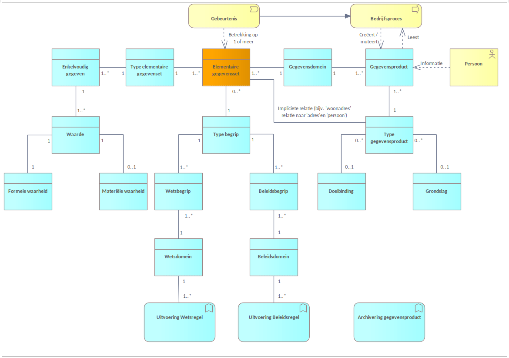

# GGHH Model

## Visualisatie

## Elementen uit het GGHH Model

In onderstaande paragrafen zijn de omschrijvingen van alle elementen uit het GGHH Model opgenomen.

### Gegevensproduct

**Archivering gegevensproduct**  
_ApplicationFunction_

Binnen de archiefwet wordt gesproken over 'documenten'. De betekenis in deze wet is echter veel breder dan wat een gemiddeld persoon ziet als een 'document'. Vandaar dat hier de term 'gegevensproduct' wordt gebruikt maar conform de wet beschouwd moet worden als een archiefwaardig document.

Omdat een gegevensproduct bestaat uit één of meerdere elementaire gegevenssets kan een groot deel van de benodigde metadata worden herleid en automatisch worden toegevoegd om de context van het gegevensproduct aan te geven. Het gegevensproduct wordt gecreëerd / gemuteerd of gebruikt in een bepaald bedrijfsproces. Hoewel buiten de scope van dit document zal dit ook als archief metadata opgeslagen moeten worden.
Van een gegevensproduct dat is ontstaan op basis van een beleidsregel of wetsregel is de metadata ook bekend op basis van de applicatiefunctie die deze regel heeft uitgevoerd. Ook deze valt buiten de scope van dit document.

### Bedrijfsproces

_BusinessProcess_

Een bedrijfsproces maakt gebruik van een gegevensproduct (leest of creëert / muteert). Dit gebruik heeft betrekking op 1 of meerdere gegevens uit 1 of meerdere elementaire gegevenssets. Vanuit het bedrijfsproces is dit onderscheid wellicht lastig te maken (ziet het as 'één geheel').

Voorbeeld 1: Een persoon verhuist naar een andere gemeente. Hiervoor zal de persoon als nieuwe inwoner bij de desbetreffende gemeente worden ingeschreven en zal de persoon bij een ander gemeente worden uitgeschreven. In dit geval zal het leiden tot een mutatie in de BRP die op zijn beurt de bron is van vele andere administraties. Dat een mutatie in de waarden kan leiden tot een (push)bericht / attenderingsbericht voor een ander bedrijfsproces / organisatie valt buiten de scope van dit document.
Voorbeeld 2: Een auto rijdt door rood en dit wordt geconstateerd door een flitspaal. Op basis van tijdstip, overtreding en aan de hand van het kenteken wordt de overtreding geregistreerd.

Op het moment dat er een actie plaatsvind op een gegevensproduct dan zou die eigenlijk moeten worden gearchiveerd in het archief (zie `'Archivering gegevensproduct'). In het ideale geval is van ieder gegevensproduct bekend uit welke 'elemenatire gegevenssets' deze is opgebouwd.

In vrijwel alle gevallen zal een bedrijfsproces de waarde van 1 of meerdere enkelvoudige gegevens uit 1 of meerdere elementaire gegevenssets creëren cq muteren.

### Beleidsbegrip

_DataObject_

Een beleidsbegrip is een begrip dat in het beleid is gedefinieerd. Dit begrip zal vertaald moeten worden naar gegevens en vormt hiermee dus een belangrijke input voor het formuleren van een 'elementaire gegevensset'.

Een beleidsbegrip kan ook betrekking hebben op een bewerking op meerdere gegevens die volgens bepaalde regels tot een resultaat leiden. Deze regels maken geen onderdeel uit van dit model

### Beleidsdomein

_DataObject_

Voorbeelden beleidsdomein: Financieel beleid, datamanegement beleid enz.

### Doelbinding

_DataObject_

Gegevens die betrekking hebben op een natuurlijk persoon en verstrekt zijn mogen alleen gebruikt wordt voor het doel waarvoor ze zijn verstrekt.

### Elementaire gegevensset

_DataObject_

Een elementaire gegevensset bestaat uit een aantal enkelvoudige gegevens die behoren tot één type elementaire gegevensset. De elementaire gegevensset is verkregen op basis van een doel op basis van een bepaalde grondslag binnen een werkproces. Hiermee zou je dan metadata kunnen vastleggen t.b.v. archivering.

Een elementaire gegevensset is herleidbaar (gedefinieerd) in een bepaald type begrip en wordt op één plek beheerd en valt onder één verantwoordelijke.

Een elementaire gegevensset bevat meestal (altijd?) een uniek kenmerk waar de elementaire gegevensset betrekking op heeft en dat binnen een gegevensdomein valt. Zo zullen elementaire gegevenselementen die betrekking hebben op een persoon altijd een uniek persoonsID bevatten (denl aan een BSN of, binnen de strafrechtketen een SKN, binnen de vreemdelingenketen een V-nummer enz.).

Een (of meerdere) Elementaire gegevensset(s) als gegevensproduct beschikbaar gesteld aan daarvoor geautoriseerde afnemers

Voorbeelden elementaire gegevensset: Adres, Persoon, zaak enz.
Bijvoorbeeld een adres van het type 'woonadres' bevat ook een persoonsID binnen het JenV domein. Binnen een ander domein hoeft dat niet zo te zijn. Zo heeft het adres van het type 'woonadres' in de BAG (Basisadministratie Adressen en Gebouwen) geen persoonsID (niet relevant in het bijbehorende domein), maar een BAG ID.

Het kan zijn dat de elementaire gegevensset afkomstig is van een (landelijke) bronadministratie. Vanuit een verantwoordingsperspectief is het aannemelijk om dit type 'elementaire gegevensset' gelijk te stellen aan een 'gegevensproduct' (een 1 op 1 relatie dus). Dit lijkt wettelijk ook zo te gelden, en kennelijk ook voor zogenaamde kernregisters (broertje van een basisadministratie, maar dan niet landelijk maar binnen een domein) waarbij het gegevensproduct gelijk is aan de 'elementaire gegevensset'.

Relatie met archief metadata: Voor dit type elementaire gegevensset is het een optie om deze set te metadateren met de archiefmetadata van de instantie van de actor (3.1 in de voorgestelde JAM). Vraag is alleen of je dit wilt doen op het niveau van een elementaire gegevensset of dat je dat beter kunt doen op het niveau van een gegevensproduct. Vanuit de archiefwereld die primair gebaseerd is op documenten lijkt dit meer voor de hand te liggen.

### Enkelvoudig gegeven

_DataObject_

Een enkelvoudig gegeven geeft betekenis aan een waarde. De waarde van een gegeven kan door de tijd veranderen, vandaar de 1 op N relatie met een 'waarde'.

Een enkelvoudig gegeven behoort tot één type elementaire gegevensset, maar één type elementaire gegevensset kan uit meerdere enkelvoudige gegevens bestaan.

Voorbeelden enkelvoudig gegevens: Straatnaam, huisnummer enz.

### Formele waarheid

_DataObject_

De formele waarheid is de waarheid zoals die is geregistreerd

### Gebeurtenis

_BusinessEvent_

In de samenleving vind een gebeurtenis plaats die een relatie heeft op de werkzaamheden van een organisatie gerelateerd (in termen van archiefwet: 'naar zijn aard te berusten'). De gebeurtenis heeft hierbij betrekking op 1 of meerdere elementaire gegevenssets. Een gebeurtenis vindt altijd plaats in de werkelijkheid in een bepaalde context.

Een gebeurtenis kan gemeld worden door een actor uit de samenleving (bijvoorbeeld een burger).

Een gebeurtenis kan geregistreerd worden vanuit een 'interne' actor (bijvoorbeeld een flitspaal of agent).

| Voorbeelden |                                                                                                                                            |
| ----------- | ------------------------------------------------------------------------------------------------------------------------------------------ |
| Voorbeeld 1 | Een persoon verhuist. Dit is relevant voor bijvoorbeeld een gemeente waar de persoon inwoner wordt of waar de persoon de gemeente verlaat. |
| Voorbeeld 2 | Een auto rijdt door rood. Dit is relevant voor de politie die de verkeerswet handhaaft.                                                    |
| Voorbeeld 3 | Een organisatie vraagt om eenmalige of periodieke levering van 1 of meer EGS's.                                                            |

### Gegevensdomein

_DataObject_
Een gegevensdomein is een verzameling van één of meerdere 'elementaire gegevensset'(s) die tot eenzelfde domein behoren.
Voorbeelden: personendomein, zakendomein

### Gegevensproduct

_DataObject_
Een gegevensproduct bestaat uit één of meerdere elementaire gegevenssets (incl. het type elementaire gegevensset) uit één bepaald domein op basis van de informatiebehoefte van de afnemer. Deze behoefte is doorgaans wettelijk bepaald. Zeker bij persoonsgebonden gegevens dient er een wettelijke grondslag/doelbinding aanwezig te zijn. Net zoals bij een elementaire gegevensset wordt een gegevensproduct gebruikt in een werkproces en kan men hiermee de metadata t.b.v. archivering vastleggen. Deze kan overigens afwijken van de 'oorspronkelijke' metadata van de/het achterliggende elementaire gegevensset(s).
Een gegevensproduct zal bij gebruik ook vallen onder de archiefwet en vanuit dat perspectief dus ook duurzaam toegankelijk moeten worden opgeslagen en zou op basis van de selectielijst ook een bewaartermijn hebben. Dit kan (B)lijvend zijn of tijdelijk (V)ernietigingstermijn.

Indien een gegevensproduct betrekking heeft op een persoon dan zou daar eigenlijk het uniek identificerend kenmerk (bijv. BSN) bij moeten. Dit om een persoon toegang te kunnen verlenen tot de bij hem behorende elementaire gegevens en bijbehorende waarden.

Waarom: Bereiken van transparantie en vertrouwen
Uitdagingen: Binnen JenV zijn meerdere manieren om een persoon uniek te identificeren. In de strafrechtketen is dit bijvoorbeeld een SKN, binnen de vreemdelingenketen is dit het V-nummer.

Een persoon die zijn gegevens wil inzien zal dat waarschijnlijk via een door de overheid verstrekt unieke identificatie gebeuren. Voor bijvoorbeeld Nederlanders is dit het BSN. Ergens zal dus de vertaalslag gemaakt moeten kunnen worden van deze unieke identificatie naar de binnen een keten gebruikte identificatie.
Relatie met archief metadata: 4.1.1. (verplicht) en 4.1.2 uit de voorgestelde JAM versie zijn hiervoor geschikt

### Grondslag

_DataObject_

Voor het mogen verwerken van (natuurlijke) persoonsgegevens is een grondslag verplicht. De geldige grondslagen zijn:

1. U heeft toestemming van de persoon om wie het gaat.
2. Het is noodzakelijk om gegevens te verwerken om een overeenkomst uit te voeren.
3. Het is noodzakelijk om gegevens te verwerken omdat u dit wettelijk verplicht bent.
4. Het is noodzakelijk om gegevens te verwerken om vitale belangen te beschermen.
5. Het is noodzakelijk om gegevens te verwerken om een taak van algemeen belang of openbaar gezag uit te oefenen.
6. Het is noodzakelijk om gegevens te verwerken om uw gerechtvaardigde belang te behartigen.

### Materiële waarheid

_DataObject_

De materiële waarheid is datgene dat zich in de werkelijkheid heeft voorgedaan.

### Persoon

_BusinessActor_

Een persoon gebruikt gegevensproducten om tot informatie te komen. Informatie is namelijk de interpretatie die een persoon geeft aan de aan hem geleverde gegevensproducten. Gegevensproducten zijn dan ook niet 'waarde vrij'. Het is de context van de gegevensproducten die bepalen of de persoon wel of niet tot de juiste informatie kan komen gezien de eigen context.

Een persoon kan wel of geen 'recht' hebben op een bepaald gegevensproduct. Dit is afhankelijk van de rol die de persoon vervult t.o.v. het gegevensproduct. In geval van gegevensproducten die een doelbinding en/of grondslag vereisen wordt dit door de wet en/of beleidskeuzes bepaald.

### Type begrip

_DataObject_

Een type begrip is afkomstig uit een bepaald begrip in een bepaalde context. Binnen het overheidsdomein zijn er een tweetal belangrijke begrippen: een wetsbegrip en een beleidsbegrip.

Een type begrip kan betrekking hebben op een set van gegevens en bepaald hiermee de definiëring van een elementaire gegevensset.

Een type begrip kan echter ook betrekking hebben op een bewerking van gegevens. In dat geval zal het resultaat van deze bewerking leiden tot een afgeleid gegeven.
VRAAG: Wat doen we met een afgeleid gegeven? Is GEEN elementaire gegevensset maar een afgeleid enkelvoudig gegeven. Beschouwen we die als 'Enkelvoudig gegeven' of niet? Je zou het ook kunnen beschouwen als een gegevensproduct.

### Type elementaire gegevenset

_DataObject_

Een type elementaire gegevensset kan bestaan uit 1 of meerdere elementaire gegevenssets.

Een type elementaire gegevensset kan één of meerdere gegevens bevatten. Dit is bepaald door de elementaire gegevensset.

Voorbeelden type elementaire gegevensset: Woonadres, BRP adres, verblijfsadres enz. Verdachte, slachtoffer, getuige enz.

### Type gegevensproduct

_DataObject_

Een gegevensproduct behoort tot een bepaald type product. Dit kunnen diverse doorsnedes zijn om een type te definieren.

### Uitvoering Beleidsregel

_ApplicationFunction_

Een applicatiefunctie van een beleidsregel zal altijd bestaan uit een input van de waarde van meerdere enkelvoudige gegevens die een bepaalde bewerking ondergaan (op basis van de beleidsregel) en leiden tot een output waarde van een (afgeleid) enkelvoudig gegeven. Het uitvoeren van een beleidsregel zal gestart worden in een proces en de werking kent in veel gevallen een tijdsperiode.

Wijziging in beleid kan resulteren in een wijziging van deze functie. Deze applicatiefunctie dient dus expliciet een geldigheidstermijn te bevatten
Vraag: Slaan we dit (afgeleide) enkelvoudig gegeven op en zo ja, met welke status?

### Uitvoering Wetsregel

_ApplicationFunction_

Een applicatiefunctie van een wetsregel zal altijd bestaan uit een input van de waarde van meerdere enkelvoudige gegevens die een bepaalde bewerking ondergaan (op basis van de wetsregel) en leiden tot een output waarde van een (afgeleid) enkelvoudig gegeven. Het uitvoeren van een wetsregel zal gestart worden in een proces en de werking kent in veel gevallen een tijdsperiode.

Wijziging in de wet kan resulteren in een wijziging van deze functie. Deze applicatiefunctie dient dus expliciet een geldigheidstermijn in te bevatten
Vraag: Slaan we dit (afgeleide) enkelvoudig gegeven op en zo ja, met welke status?

### Waarde

_DataObject_

De waarde heeft altijd betrekking op één enkelvoudig gegeven die de betekenis duid van de waarde. Door de tijd kunnen waardes veranderen zodat een enkelvoudig gegevens dus betrekking kan hebben op meerdere waardes (door de tijd). Het muteren van een waarde zal altijd een gevolg zijn van een gebeurtenis zijn

Een opgeslagen waarde in een systeem zal altijd betrekking hebben op een formele waarheid (de waarde zoals die in de registratie voor komt) en in bijna alle gevallen op de materiële waarde (de 'werkelijkheid' waarop de geregistreerde waarde betrekking op heeft).

Aangezien de waarde in de tijd veranderd, is de formele waarheid niet altijd in sync met de materiële waarheid. Daar waar er sprake is van het tijdelijk 'out of sync' zijn wordt gesproken van een mutatie van de formele waarde zodat die weer in lijn is met de materiële waarheid.

Het kan ook voor komen dat de materiële werkelijkheid zich nooit heeft voorgedaan zoals die als formele werkelijkheid is geregistreerd. In dat geval is er sprake van een correctie van de formele waarheid. Strikt genomen hebben zijn alle besluiten die zich op basis van deze waarheid hebben plaatsgevonden 'fout' en zouden nooit genomen mogen zijn. Een correctie vereist dan ook een andere verwerking dan een mutatie.

### Wetsbegrip

_DataObject_

Een wetsbegrip is een begrip dat in de wet is gedefinieerd. Dit begrip zal vertaald moeten worden naar gegevens en vormt hiermee dus een belangrijke input voor het formuleren van een 'elementaire gegevensset'.

Een wetsbegrip kan ook betrekking hebben op een bewerking op meerdere gegevens die volgens bepaalde regels tot een resultaat leiden. Deze regels maken geen onderdeel uit van dit model

### Wetsdomein

_DataObject_

Voorbeelden wetsdomein: Strafrecht, bestuursrecht, belastingrecht enz.
